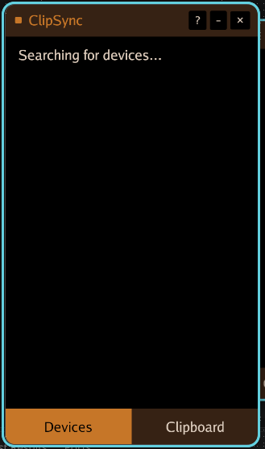
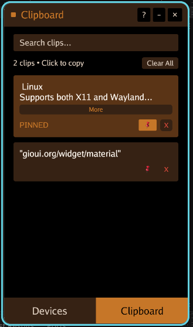

<h2 align="center">
  <b>Copy on your Desktop. Paste on your Android. </b><i>(and vice versa)</i><br>
  <sub>No account. No friction. Same clipboard content on all devices connected.</sub>
</h2>

<p align="center">
  
  
  <a href="https://diamondosas.github.io/clipsync/">
    
  </a>
</p>

<!-- ---

**ClipSync** is an open-source clipboard tool that syncs across every device on your local network — Windows, macOS, Linux — instantly. Built in Go. Runs silent. Uses barely any CPU,  RAM. No servers.

--- -->

<h3 align="center">Screenshots</h3>

<p align="center">
  
  
</p>

---
<h2 align="center">


**[> Download ClipSync <](https://github.com/diamondosas/clipsync/releases)**

</h2>


---

---

## Features

- Automatic device discovery
- Lightweight background process (~15 MB RAM, ~0.1% CPU)
- Fast clipboard sync across devices
- Support Wifi
- Works on Windows, macOS, and Linux
- Supports both X11 and Wayland
- Clipboard Management
---

---

## Linux Setup — One Extra Step

On Linux, ClipSync needs access to the X11 or Wayland clipboard layer. Install the right libraries for your distro first:


**Debian / Ubuntu / Pop!_OS / Mint**
```bash
sudo apt install libx11-dev libwayland-dev libxkbcommon-dev libvulkan-dev
```

**Fedora / CentOS / RHEL / AlmaLinux**
```bash
sudo dnf install libX11-devel libwayland-dev libxkbcommon-dev vulkan-headers
```

**Arch / Manjaro / EndeavourOS**w
```bash
sudo pacman -S libx11 libwayland-dev libxkbcommon-dev libvulkan-dev
```

Display Server Libraies _check using :_ `echo $XDG_SESSION_TYPE`

**Wayland** 

```bash
sudo apt install wl-clipboard
```

**X11** 
```bash
sudo apt install xclip
```
---
---

## ⭐ Star History

If ClipSync saves you time, star it. Helps other people find it.

<!-- <picture>
  <source media="(prefers-color-scheme: dark)" srcset="https://api.star-history.com/chart?repos=diamondosas/clipsync&type=date&theme=dark&legend=top-left" />
  <source media="(prefers-color-scheme: light)" srcset="https://api.star-history.com/chart?repos=diamondosas/clipsync&type=date&legend=top-left" />
  
</picture> -->

---
